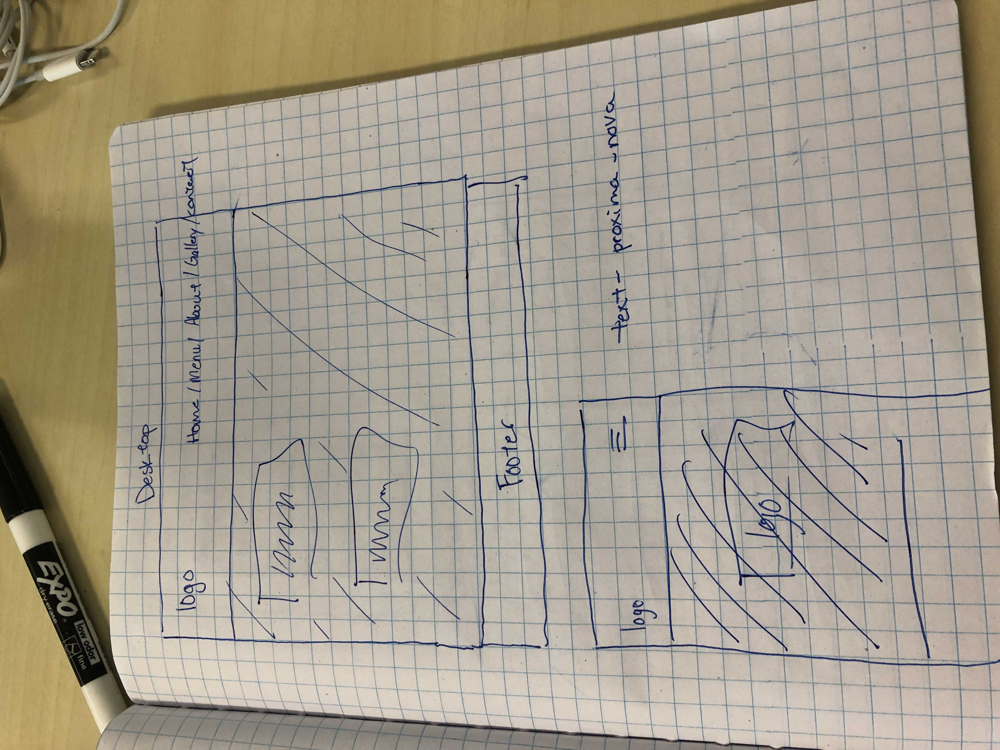
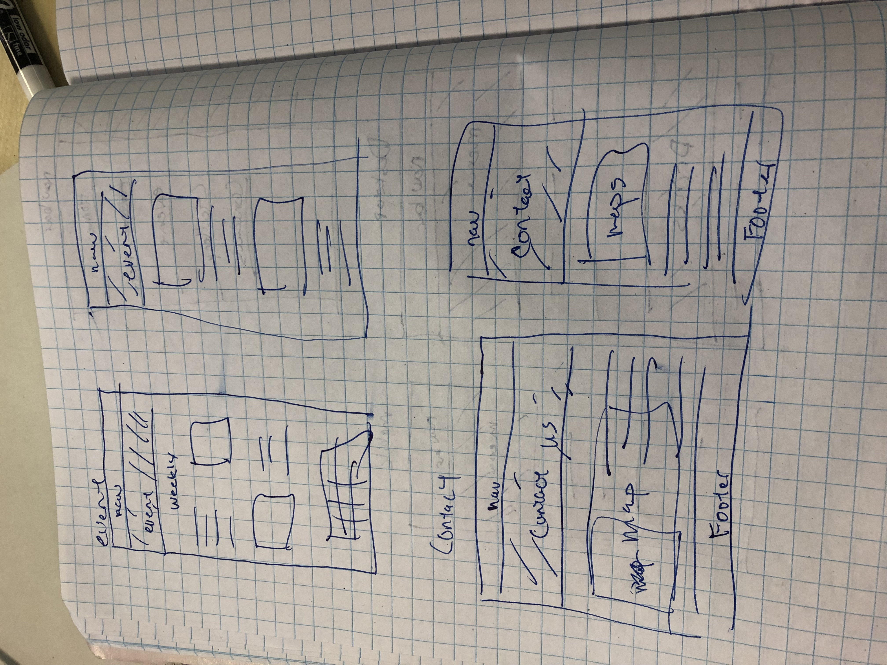
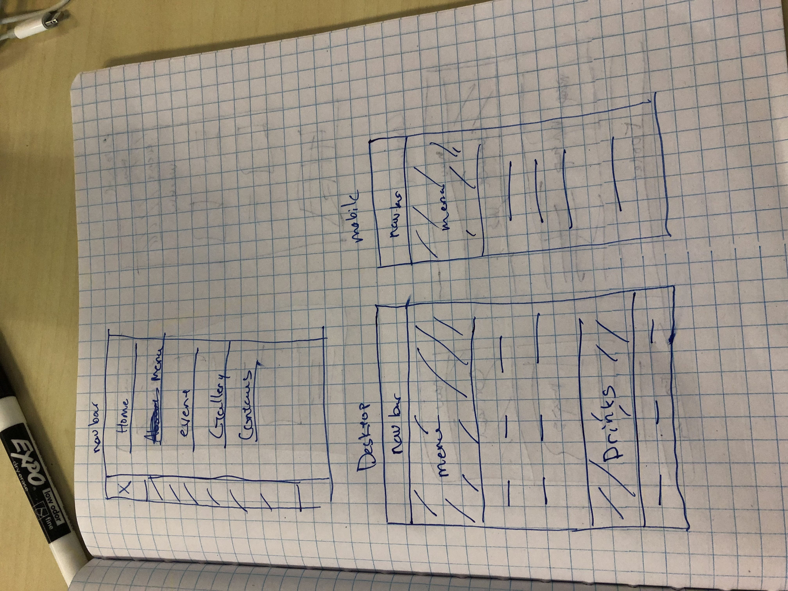

## Brickyard Tavern 2.0
---

#### Leo Mangutov, Kohichi Horii
#### March 5, 2019

### Description

This is a website redesign of a Beaverton bar, helping out a local community business establishment, a website that is easy to navigates and is responsive in all media screen types, redesigning their logo and layout.

### Images

#### Desktop Version

#### Mobile Version

### User Stories

* We'll  
* Learn
* About
* These
* Monday
* Night

### Technologies and Resources

* List
* What
* Outside
* Technologies
* You've
* Used
* Here

### Responsiveness

Describe how the site is responsive, and what different 'versions' this project includes (does it have a mobile version? tablet version? )

### Setup Instructions

Describe how someone can clone and launch this project.

### Roadmap

Is there work you plan on continuing doing on this project? Features you'd like to add?

* Consider
* Listing
* Them
* Here

### License

Determine the license under which this application can be used.

Copyright (c) 2018 **_{ List of Contributors }_**
